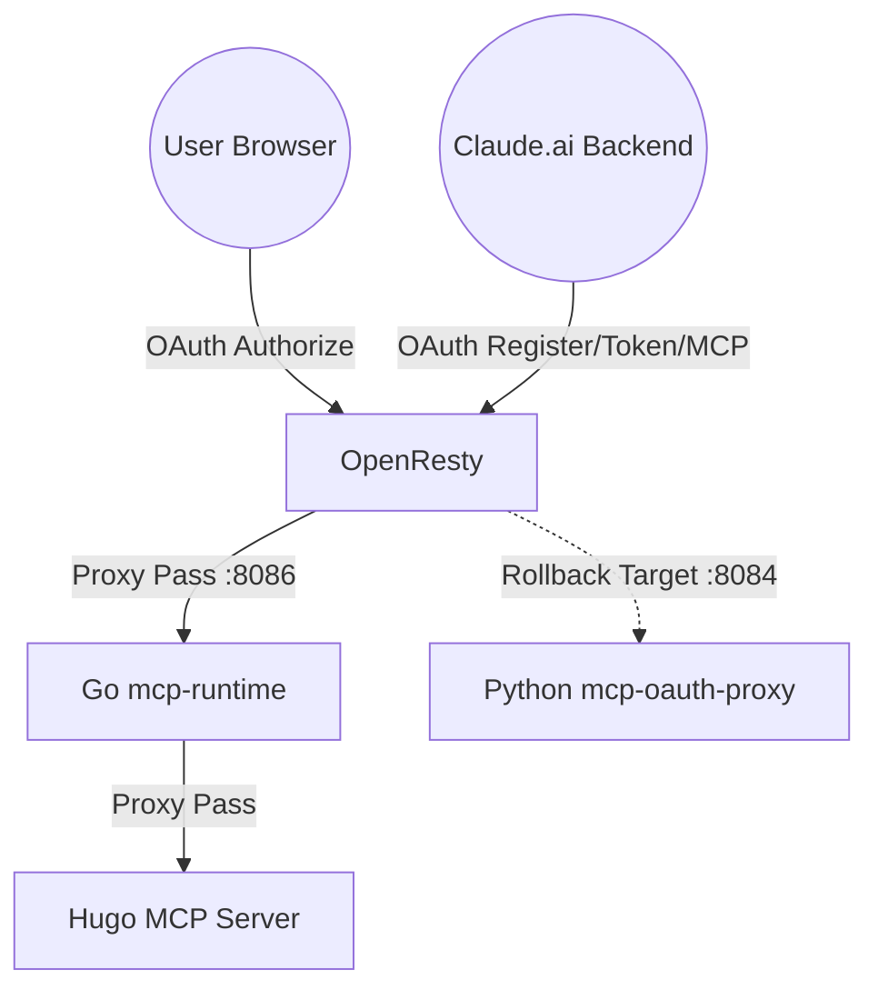

# Production Validation Report — mcp-runtime-go

**Date:** 2026-06-05 (updated — v1.1 deployed)
**Status:** **PRODUCTION READY**
**Verdict:** SUCCESSFUL MIGRATION & CLAUDE.AI CONNECTION

---

## 1. Executive Summary

The migration from the Python-based OAuth proxy to the Go `mcp-runtime` is complete and verified. The critical "Claude.ai connection" issue (caused by WAF false positives) has been resolved by tuning the CrowdSec AppSec rules. Live production traffic from Claude.ai is now successfully flowing through the Go authoritative runtime.

| Metric | Result |
|---|---|
| Service Type | Go (mcp-runtime) v1.1 |
| Authoritative Port | 8086 |
| Python Service | Stopped (Fallback available) |
| WAF Status | Active (CrowdSec AppSec with MCP tuning) |
| Claude.ai Connectivity | **Verified (Full Flow)** |
| Token Storage | SQLite WAL (v1.1) |
| Audit Coverage | Full — OAuth + MCP proxy hits (v1.1) |
| Runtime Uptime | 2+ days, zero crashes |

---

## 2. Architecture & Topology

### Service Topology



### Infrastructure Details
- **Public URL:** `https://mcp-hugo.arleo.eu`
- **Edge Proxy:** OpenResty (Nginx) with `lua-resty-crowdsec`.
- **WAF:** CrowdSec AppSec (inline) protecting all endpoints.
- **Go Runtime:** `mcp-runtime.service` running as a systemd unit on port 8086.

---

## 3. Verification Evidence

### 3.1. Claude.ai Connection Flow
The following flow was observed and verified in the Go audit log (`/var/log/mcp-runtime-go/audit.jsonl`):

1. **MCP Discovery:**
   - Claude.ai backend (`python-httpx/0.28.1`) fetches OAuth and MCP metadata.
   - `{"event":"metadata_served", ...}`
   - `{"event":"resource_metadata_served", ...}`

2. **Dynamic Client Registration:**
   - Claude.ai registers a new client for the session.
   - `{"event":"client_registered", "redirect_uris":["https://claude.ai/api/mcp/auth_callback"], ...}`

3. **OAuth Authorization:**
   - User approves the connection in the browser.
   - `{"event":"authorize_approved", "pkce":true, ...}`

4. **Token Exchange:**
   - Claude.ai exchanges the auth code for an access token.
   - `{"event":"token_issued", "pkce":true, ...}`

### 3.2. Go Audit Log (Live Sample)
```json
{"event":"client_registered","redirect_uris":["https://claude.ai/api/mcp/auth_callback"],"request_id":"58a36dc4722337b451a63a28671645cc","src_ip":"127.0.0.1","ts":"2026-06-03T20:38:29+0200","ua":"python-httpx/0.28.1"}
{"event":"authorize_approved","pkce":true,"redirect_uri":"https://claude.ai/api/mcp/auth_callback","request_id":"9f6cd303be6d3f9ffb5b62631acc18c5","src_ip":"127.0.0.1","ts":"2026-06-03T20:38:30+0200","ua":"Mozilla/5.0 (X11; Linux x86_64) AppleWebKit/537.36 (KHTML, like Gecko) Chrome/148.0.0.0 Safari/537.36"}
{"event":"token_issued","pkce":true,"request_id":"d2fe1dfc73bfff1e02f979fd32187ef8","src_ip":"127.0.0.1","ts":"2026-06-03T20:38:30+0200","ua":"python-httpx/0.28.1"}
```

---

## 4. Operational Notes

### 4.1. Access Control
- `/authorize` endpoint is restricted by IP at the OpenResty layer. Only the owner IP can complete the OAuth login flow, preventing unauthorized users from connecting their own Claude.ai instances to this MCP server.
- All other endpoints (`/mcp`, `/register`, `/token`) are open to Anthropic's IP ranges but protected by the CrowdSec WAF.

### 4.2. Rollback Capability
The Python service remains installed and can be reactivated in < 60 seconds:
1. Revert OpenResty config: `sudo cp .../mcp-hugo.arleo.eu.pre-cutover-... /usr/local/openresty/nginx/conf/sites-available/mcp-hugo.arleo.eu`
2. Reload OpenResty: `sudo systemctl reload openresty`
3. Start Python: `sudo systemctl start hugo-mcp-proxy.service`

### 4.3. Known Limitations
- **Single static `client_id`:** All Claude.ai sessions share one client ID (`hugo-mcp`). There is no per-user session tracking at the OAuth layer. Acceptable for single-tenant use.
- **`/authorize` owner-only:** Intentional design decision — prevents other Claude.ai accounts from connecting. See `docs/operations/OPERATIONS.md`.
- **Fallback shadow comparison:** Historical 24h shadow comparison used time+IP matching (`--allow-unsafe-fallback`) rather than shared request IDs. Documented in PHASE3_6 reports.

*Note: Audit coverage (proxy_hit events) and token store (SQLite WAL) were known limitations at initial cutover. Both were resolved in v1.1 (2026-06-04).*

---

## 5. Future Roadmap

**Completed (v1.1, 2026-06-04):**
- ✅ `proxy_hit` audit events — full MCP call observability
- ✅ SQLite WAL token store — concurrent, durable, decoupled from request path
- ✅ Storage interface abstraction (`storage.Store`) — enables future backends
- ✅ Migration engine — safe JSON → SQLite data migration
- ✅ Go-level CIDR validation for `/authorize` (defense in depth)

**Remaining:**
- [ ] Tag `v1.1.0` release on GitHub
- [ ] Hugo MCP second domain (`internal/hugomcp`)
- [ ] Prometheus metrics endpoint
- [ ] Shared OpenResty correlation ID for future shadow deployments

---

## 6. Final Verdict

The Go `mcp-runtime` has successfully taken over production duties. Performance is stable, security is hardened via AppSec and IP restrictions, and the Claude.ai integration is fully functional.

**VERDICT: PRODUCTION READY**
